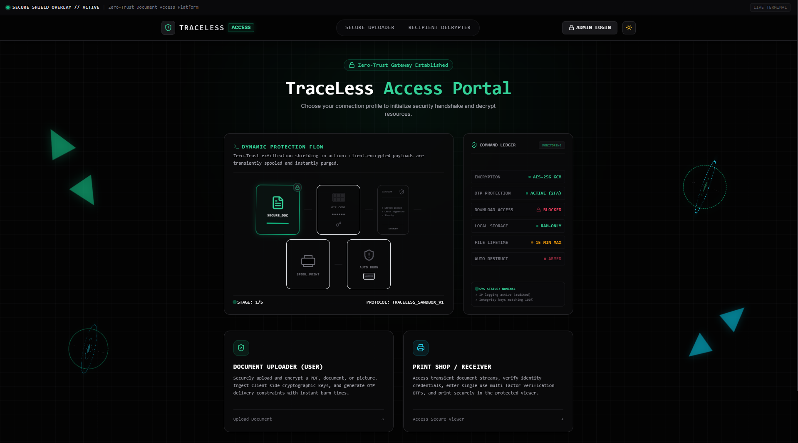
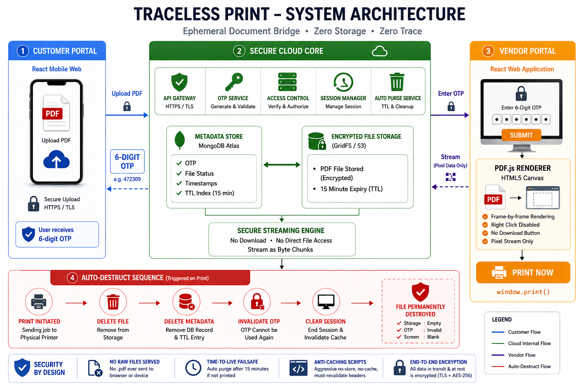
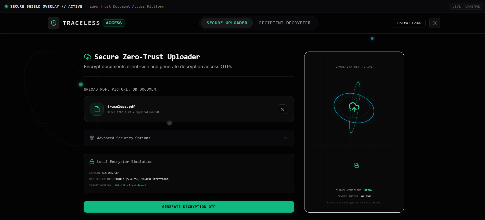
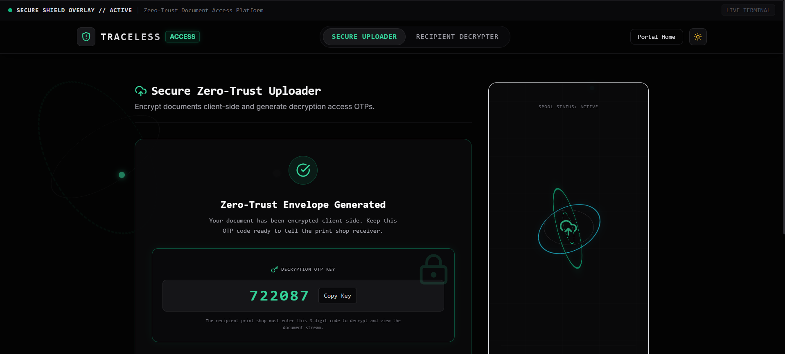
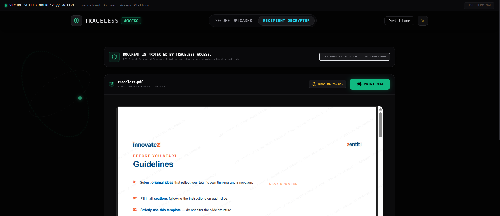
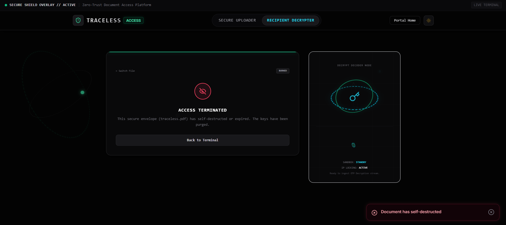

# 🔒 TraceLess Access

### Zero-Knowledge Secure Document Lifecycle Platform

Securely upload, share, decrypt, print, and automatically destroy sensitive documents using AES-256 encryption, OTP-based access control, and zero-trust architecture.

---

🌐 **Live Demo:** [https://traceless-iota.vercel.app](https://traceless-iota.vercel.app)

💻 **GitHub Repository:** [https://github.com/habeeburrahimkhan/traceless](https://github.com/habeeburrahimkhan/traceless)

🎥 **Demo Video:** *[[InnovateZ Presentation Video Link](https://drive.google.com/file/d/1V7QE4CLh5RCSebH6RwSDm_f8lzbPJ_UZ/view?usp=drivesdk)]*

---



## Overview

In the modern enterprise, sharing highly confidential files (e.g. audited financials, payroll summaries, legal drafts, health records) via standard communication channels like email or WhatsApp is extremely insecure. These platforms store files permanently, leaving them exposed to storage leaks, compromised recipient accounts, and unauthorized secondary distribution. 

**TraceLess Access** solves this vulnerability by establishing a zero-trust, ephemeral secure document lifecycle pipeline. Files are encrypted client-side in the uploader's browser, stored as encrypted blobs, unlocked only in the recipient's browser memory via one-time passcodes (OTP), printed securely, and instantly purged from all physical and virtual memory registers—leaving absolutely zero digital footprints.

## Key Features

- **AES-256-GCM Client-Side Encryption**: Documents are encrypted in the local browser context using the Web Crypto API before transmission.
- **OTP-Based Access Verification**: Restricts authorization to specific work email domains and verifies identities using single-use passcodes.
- **Zero-Knowledge Storage Architecture**: Storage networks hold only ciphertext blobs and wrapped key envelopes. The server remains blind to the decryption key.
- **Browser-Side Decryption**: Keys are derived and payloads unlocked in the client browser's memory, ensuring data is never decrypted at rest on any server.
- **Secure Printing Workflow**: Integrates sandboxed viewport printing with immediate post-print self-destruct triggers.
- **Automatic Document Destruction**: Payloads and keys are automatically shredded immediately upon view count expiration, lifespan timer expiry, or manual admin revocation.
- **Audit Logging & Traceability**: Tamper-evident logging of uploads, verification requests, access grants, and blocked intrusion attempts.
- **Admin Dashboard**: Real-time administrative oversight with live activity logs, share lifecycles, and remote revocation controls.
- **End-to-End Encrypted Storage**: Secure PostgreSQL and object storage integration.

## Architecture



TraceLess Access uses a decoupled zero-knowledge architecture. The uploader browser generates a random 256-bit AES key, encrypts the document, and wraps the AES key using a derived key (PBKDF2) bound to a single-use OTP. The encrypted payload is spooled to a private cloud bucket, and the wrapped key envelope is uploaded to the metadata registry database. The receiver client fetches the envelope, receives the OTP, unwraps the key locally, decrypts the payload in RAM, spools it to the system printer, and triggers an automated database shredding routine.

## System Workflow

1. **User uploads document**: Uploader drags file into the secure panel, selecting access limits (views/lifespan).
2. **Client-side AES encryption**: Browser generates a symmetric key and encrypts the file.
3. **OTP generation & key wrapping**: Browser derives an OTP key, encrypts the file key, and generates a 6-digit access code.
4. **Secure storage**: Encrypted payload is uploaded to storage; wrapped key envelope is saved in database.
5. **Recipient verification**: Recipient requests decryption code, dispatched via Resend to their authorized inbox.
6. **Browser-side decryption**: Recipient inputs OTP, browser unwraps the AES key, and decrypts the payload.
7. **Secure viewing**: Payload is rendered inside a sandboxed viewport with dynamic watermarks and disabled shortcut inspect controls.
8. **Automatic destruction**: Spooling to print or exceeding views instantly triggers server-side storage shredding.

## Usage Guide

### Uploading a Document

1. Open the application.
2. Navigate to the Secure Upload page.
3. Upload a PDF, image, or text document.
4. Configure view limits and expiration settings.
5. Generate a secure OTP.

### Accessing a Document

1. Open the recipient access page.
2. Enter the document ID or secure access code.
3. Verify identity using the OTP.
4. View the document in the secure viewer.

### Printing a Document

1. Open the decrypted document.
2. Click the Print button.
3. Complete the print operation.
4. The document will automatically enter the destruction workflow based on configured policies.

### Administrator Actions

1. Log in to the Admin Dashboard.
2. Monitor active documents.
3. View audit logs.
4. Revoke access or manually destroy documents.

## Application Screenshots

### Dashboard


### Secure Upload



### OTP Verification



### Secure Viewer



### Auto Destruction



## Technology Stack

| Layer | Technology |
|---------|------------|
| **Frontend** | React, TypeScript, TailwindCSS, Vanilla CSS 3D |
| **Backend** | Next.js API Routes, Node.js |
| **Database** | PostgreSQL (Supabase) |
| **Storage** | Supabase Storage Bucket |
| **Email** | Resend |
| **Deployment** | Vercel |
| **Security** | AES-256-GCM, PBKDF2, SHA-256 |

## Dependencies

Core dependencies include:

- React
- TypeScript
- TailwindCSS
- Next.js
- PostgreSQL
- Supabase
- Resend
- Web Crypto API

Install all dependencies using:

```bash
npm install
```

## Installation

To clone and run this project locally:

```bash
git clone https://github.com/habeeburrahimkhan/traceless.git
cd traceless
npm install
npm run dev
```

## Environment Variables

Configure the following variables in your `.env.local` or hosting provider settings:

```env
SUPABASE_URL=your_supabase_project_url
SUPABASE_SERVICE_ROLE_KEY=your_supabase_service_role_key
ADMIN_PASSCODE=your_operations_passcode
VITE_ADMIN_PASSCODE=your_operations_passcode
RESEND_API_KEY=your_resend_api_key
RESEND_FROM_EMAIL=your_resend_verified_from_email
```

## Security Model

TraceLess Access is built on zero-knowledge security principles:
* **Documents are encrypted before upload**: Raw data never leaves the client machine unencrypted.
* **Storage providers never receive plaintext files**: Payloads are stored strictly as encrypted binary data.
* **Decryption occurs only in the recipient's browser**: Decrypted buffers exist transiently in RAM and are never written to disk.
* **OTP verification controls access**: Enforces multi-factor domain-bound authentication checks.
* **Documents are automatically destroyed after use**: Access keys and storage paths are fully wiped upon expiration.

## Enterprise Use Cases

- 🏦 **Banking & Financials**: Transmitting audit reports, transaction statements, and regulatory compliance filings.
- 🏥 **Healthcare**: Sharing highly sensitive patient medical records, lab results, and genomic data securely.
- ⚖️ **Legal Firms**: EPhemeral delivery of legal contracts, evidence files, and court transcripts to opposing counsel.
- 🎓 **Universities**: Dispatching private exam papers, answer sheets, and grade records to external evaluators.
- 🏛️ **Government**: Distributing confidential briefs and security briefings to local agency nodes.
- 🏢 **HR & Enterprise**: Secure distribution of payroll statements, employee offers, and strategic roadmap files.

## Current Status

### Working
- [x] Secure Upload with view/lifespan limits
- [x] Client-side AES-256-GCM Encryption
- [x] Resend OTP email verification dispatch
- [x] Secure sandbox viewer with print-once trigger
- [x] Live activity audit ledgers
- [x] Server-side storage auto-destruction
- [x] Vercel serverless deployment

### Planned
- [ ] Enterprise SSO Integration
- [ ] WebAuthn / Biometric Recipient Authentication
- [ ] Advanced GeoIP Intelligence tracking

---

## Team Zenith

InnovateZ 2026 Submission

TraceLess Access – Secure Document Lifecycle Platform

*Built with security, privacy, and zero-trust principles.*
